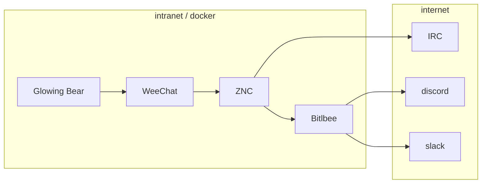

# IRC

## Fonctionnement général



## Weechat

[Image Docker]() ⋅ [Documentation](https://weechat.org/files/doc/stable/weechat_user.fr.html) ⋅ [FAQ](https://weechat.org/files/doc/stable/weechat_faq.fr.html) ⋅ [Quick Start](https://weechat.org/files/doc/stable/weechat_quickstart.fr.html)

```bash
$ docker attach weechat
```

## ZNC

[Image Docker](https://hub.docker.com/_/znc) ⋅ [Documentation](https://wiki.znc.in/ZNC)

## Bitlbee

[Image Docker](https://hub.docker.com/r/ezkrg/bitlbee-libpurple) ⋅ [Documentation](https://www.bitlbee.org/user-guide.html)

### Slack

https://api.slack.com/custom-integrations/legacy-tokens

## Glowing Bear

On n'est pas obligé de déployer Glowing Bear, on peut utiliser la version hébergée sur https://www.glowing-bear.org/. Mais l'image est là au cas où.

### Activation du relai avec le protocole Weechat

L’extension Relay peut envoyer les données à une interface distante en utilisant le protocole WeeChat.

```
/set relay.network.password "motdepasse"
/relay add weechat 9001
```

